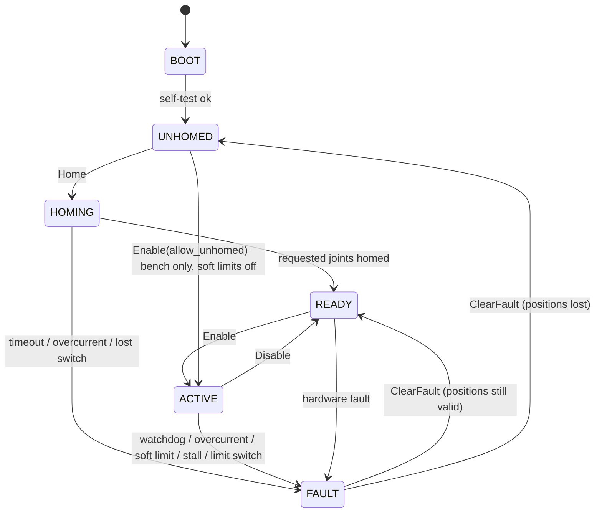

# Scorbot controller protocol, version 1.0

The link between the Raspberry Pi (ROS 2 `ros2_control` hardware interface) and the
ESP32 motor controller. This page is written for whoever implements the firmware side.
The source of truth for message contents is `proto/scorbot/v1/scorbot.proto`; this
page adds the byte layer, timing, and behaviour rules that the `.proto` cannot express.

## 1. Layers

| Layer | Serial (v1) | UDP (later) |
| --- | --- | --- |
| Physical | 921600 baud, 8 data bits, no parity, 1 stop bit, no flow control | WiFi |
| Framing | `COBS(payload ‖ crc16) ‖ 0x00` | one payload per datagram |
| Encoding | protobuf via nanopb, `Envelope` message | same |

Everything above framing is identical on both transports.

## 2. Framing on serial

```
frame := COBS( payload ‖ CRC16_BE(payload) ) ‖ 0x00
```

- `payload` is one encoded `scorbot.v1.Envelope`.
- `CRC16` is CRC-16/CCITT-FALSE: polynomial 0x1021, initial value 0xFFFF, no bit
  reflection, no final XOR. Check value: CRC of the ASCII string `123456789` is `0x29B1`.
  It is appended big-endian (high byte first) *before* COBS encoding.
- COBS makes the result free of 0x00 bytes; the single 0x00 after it is the delimiter.
- Maximum payload: `scorbot_v1_Envelope_size` from the generated header (906 bytes for
  protocol 1.0). Receivers must accept frames up to `kMaxFrame` in `framing.hpp`
  (1024-byte payload budget plus CRC and COBS overhead) and discard longer ones.

Receiver rules (implemented in `StreamDecoder`; the firmware must behave the same):

1. Accumulate bytes until a 0x00.
2. Two 0x00 in a row (empty frame) is an idle line, not an error.
3. COBS-decode; on failure, drop the frame and count it.
4. Fewer than 2 decoded bytes: drop and count.
5. Split off the last two bytes as the CRC; verify against the rest; mismatch: drop and count.
6. Deliver the payload to the protobuf decoder. A payload that does not parse as an
   `Envelope` is dropped and counted, never acted on.
7. Buffer overflow before a delimiter: discard everything up to and including the next
   delimiter, count it.

Line noise directly before a frame (with no delimiter between) fuses with that frame
and costs that one frame. This is by design: the next delimiter resynchronises.

### Worked examples (generated by the reference implementation)

Ping request, `seq=1`, `timestamp_us=1000`, `request_id=1`, `nonce=0x42`:

```
payload (14): 08 01 10 e8 07 62 07 08 01 92 01 02 08 42
crc16:        5d e6
frame (18):   11 08 01 10 e8 07 62 07 08 01 92 01 02 08 42 5d e6 00
```

Pong response, `seq=1`, `request_id=1`, `result=OK`, `pong=0x42`:

```
payload (12): 08 01 10 dc 0b 6a 05 08 01 90 01 42
frame (16):   0f 08 01 10 dc 0b 6a 05 08 01 90 01 42 57 e6 00
```

JointCommand, 5 joints in POSITION mode, joint 0 at 0.5 rad (note the zeros in the
float arrays turning into COBS block codes):

```
payload (58): 08 02 10 d0 0f 52 33 0a 05 01 01 01 01 01 12 14 00 00 00 3f 00 ... 00
frame (62):   11 08 02 10 d0 0f 52 33 0a 05 01 01 01 01 01 12 14 01 01 02 3f 01 ... 03 4b 19 00
```

JointState, 5 joints, ACTIVE, all homed, joint 0 at 0.5 rad, `boot_count` 1: 102 bytes
of payload, 106 on the wire. At 100 Hz that is 10.6 kB/s, 12% of the serial capacity.

GetInfo request: `0b 08 03 10 a0 1f 62 04 08 02 52 03 71 eb 00`.
Home request, joints 0 to 4, 30 s timeout: `14 08 04 10 88 27 62 0a 08 03 72 06 08 1f 10 b0 ea 01 fd 87 00`.
Event, fault raised = WATCHDOG: `0c 08 09 10 f0 2e 72 02 08 01 51 aa 00`.

## 3. Messages

Every frame is one `Envelope`: `seq` (per-sender counter, wraps, gaps = lost frames),
`timestamp_us` (sender's monotonic clock, diagnostics only), and exactly one payload:

| Payload | Direction | When | Purpose |
| --- | --- | --- | --- |
| `JointCommand` | Pi → controller | 100 Hz while ACTIVE | per-joint mode and setpoint |
| `JointState` | controller → Pi | 100 Hz always, from a hardware timer | positions, velocities, currents, flags, system state, counters, `boot_count` |
| `Request` | Pi → controller | on demand | GetInfo, SetCalibration, SetRobotType, SetWatchdog, Home, Enable, Disable, ClearFault, Ping |
| `Response` | controller → Pi | one per Request | echoes `request_id`; `result` plus optional body |
| `Event` | controller → Pi | on occurrence | fault raised, homing progress/complete, limit switch edges, state change |

Units: radians, radians per second, amperes (signed with the joint's positive
direction). Joint index `i` in every repeated field is joint `i` of
`GetInfoResponse.joint_names`, which must equal the robot description's joint order.
`*_count` fields (nanopb) say how many joints a message carries; the Pi sends and
expects the controller's joint count.

Requests: the Pi keeps at most one request in flight. The controller answers every
`Request` with exactly one `Response` carrying the same `request_id`, within 100 ms
for everything except `Home`, which answers immediately with `RESULT_OK` (sequence
started) or an error, and reports progress through `Event`s and `JointState.state`.
Unknown request bodies get `RESULT_UNSUPPORTED`. `Response.message` is free text for
humans, empty on success.

## 4. State machine



Rules the firmware must implement:

- Motors are braked in every state except HOMING and ACTIVE.
- `JointCommand` is applied only in ACTIVE. Otherwise it is counted in
  `commands_ignored` and dropped.
- Watchdog: in ACTIVE, if no `JointCommand` arrives for `watchdog_ms` (default 200,
  settable with `SetWatchdog`; 0 disables, bench only), enter FAULT with
  `FAULT_WATCHDOG`. Every accepted command re-arms it.
- Soft limits from `JointCalibration` are enforced in both command modes: position
  setpoints are clamped, velocity setpoints ramp to zero approaching a limit, and
  `JointFlags.at_soft_limit` is set while clamping. Overrunning a limit is
  `FAULT_SOFT_LIMIT`.
- `max_velocity_rad_s` and `max_accel_rad_s2` limit what the inner loop will follow
  regardless of what is commanded.
- Current above `current_limit_a` is `FAULT_OVERCURRENT`. Homing uses current rise as
  its hard-stop detector, so the firmware must also expose the raw current in
  `JointState.current`.
- The limit switch state is always reported in `JointFlags.limit_switch` and each edge
  sends `Event.limit_switch_mask`. During HOMING the switch is the target. On the
  Scorbots the switches sit mid-range, so a pressed switch in ACTIVE is normal (the arm
  parks on it after homing) and is **not** a fault; travel ends are enforced by the
  soft limits from the encoders. `FAULT_LIMIT_SWITCH` exists for a build where a
  switch is at the end of travel; the firmware may enable that per robot.
- Every fault brakes all joints, latches `JointState.fault`, marks the offending joint's
  `JointFlags.fault`, and sends `Event.fault_raised`. `ClearFault` returns to READY
  if positions are still trustworthy (watchdog, soft limit, limit switch) and to
  UNHOMED if not (encoder, driver, stall).
- Every state transition sends `Event.state_changed`, and `JointState.state` is the
  authoritative current state. Events caused by a request (the `state_changed` from
  `Enable`, the `fault_raised` from a refused move) go out *before* that request's
  `Response`; `seq` is assigned in transmit order so the Pi never sees a gap.
- Homing search, per joint in the mask: drive in `home_direction` at homing speed until
  the switch trips. If the hard stop is reached first (current spike), reverse once,
  drive through the switch, and re-approach from `home_direction` so the encoder is
  always zeroed on the same switch edge. If the switch is already pressed when homing
  starts (the arm parks on it after a previous homing), back off against
  `home_direction` until it releases and then a definite margin further (one switch
  width, about 0.02 rad, or more; a firmware setting), then approach again at homing
  speed: a pressed switch at the start is never "found", and the edge is always met at
  the same speed from the same side. Latch the encoder count in the switch interrupt, not on the
  next control-loop iteration.
- `boot_count` increments on every reset and is carried in every `JointState` as well
  as `GetInfo`. The Pi uses it to detect that the controller rebooted (for example when
  the e-stop cuts power) and that calibration must be re-checked and homing repeated.

## 5. Timing

| What | Value |
| --- | --- |
| `JointState` rate | 100 Hz, hardware timer, independent of received commands |
| `JointCommand` rate | 100 Hz from the Pi while ACTIVE |
| Inner control loop | 1 kHz recommended; report the measured period in `control_loop_period_us` |
| Setpoint handling | interpolate between consecutive 100 Hz setpoints so the inner loop never starves |
| Watchdog default | 200 ms |
| Request response deadline | 100 ms (Home: immediate acknowledgement) |
| Serial latency for a 106-byte frame | ~1.2 ms at 921600 baud |

## 6. Calibration ownership

The Pi pushes one `SetCalibration` per joint at configure time, from
`scorbot_description/config/<robot>_calibration.yaml`. The controller stores it in
non-volatile memory, applies it immediately, and reports it back in `GetInfo`. The
controller converts encoder counts to radians itself:

```
counts    = encoder_invert ? -raw_counts : raw_counts      // encoder phase order
joint_rad = sign * (counts / counts_per_motor_rev / gear_ratio) * 2π + home_offset_rad
sign      = invert ? -1 : +1                               // joint direction vs. motor
motor     = sign * command                                 // drive sign follows the joint sign
```

The two flags are independent because the encoder phases (P0/P1) are wired in
opposite order on the two Scorbots while the motors are the same, so a positive motor
drive makes the raw count rise on one arm and fall on the other. `encoder_invert` makes
the count follow the motor; `invert` then makes both follow the description's positive
joint direction. Commissioning finds them in that order: drive positive, check the
count rises (else `encoder_invert`), check the joint moves in the model's positive
direction (else `invert`). A wrong `encoder_invert` is a positive-feedback runaway, not a
sign error: the loop pushes harder the further it gets. The firmware must refuse to
enable position or velocity control until calibration has been pushed.

with counts zeroed at the limit switch during homing: `home_offset_rad` is the joint
angle of the switch edge that trips when approached from `home_direction` (the Scorbot
switches sit mid-range and stay pressed for a short travel past that edge). Nothing
robot-specific is compiled into the firmware; `SetRobotType` labels the unit so the Pi
can refuse a mismatch.

## 7. Versioning

`GetInfoResponse.protocol_major/minor` identify what the firmware speaks. The Pi refuses
to configure on a major mismatch and warns on a minor mismatch. The `.proto` only ever
gains fields with new numbers; a field's meaning never changes within a major version.
Both sides use nanopb 0.4.9.1 and the committed generated code; CI regenerates and
diffs it.

## 8. Firmware integration checklist

1. Copy `generated/scorbot/v1/scorbot.pb.{h,c}` and `third_party/nanopb/pb*.{h,c}` into
   an ESP-IDF component. Build with `PB_ENABLE_MALLOC=0`.
2. Port `cobs.hpp` and `crc16.hpp` to C (they are short, pure functions) or compile the
   headers as C++; the test vectors in `test/test_cobs.cpp` and `test/test_framing.cpp`
   are the acceptance test.
3. UART driver with a dedicated RX task feeding a `StreamDecoder`-equivalent, and a TX
   queue so the control loop never blocks on the link.
4. Answer `Ping` and `GetInfo` first. `scorbot_protocol_cli --port <dev> ping` and
   `info` are the bench acceptance test for the link.
5. Implement the state machine with `Enable(allow_unhomed)` and `Disable` before any
   motion; `monitor` should show state changes and 100 Hz `JointState`.
6. Then `JointCommand` in velocity mode on one joint, then position mode, then homing.
